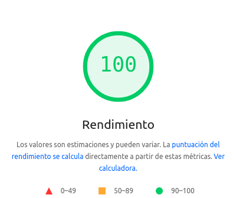
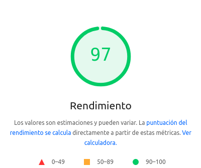

# alejandrodecora.es

Un SPA sencilla a modo de presentación, está hecha con JavaScript vainilla utilizando
funcionalidades modernas como web components.

Un página muy sencilla con un buen rendimiento en [PageSpeed Insights](https://pagespeed.web.dev):

| En escritorio                                | En dispositivos móviles                    |
| -------------------------------------------- | ------------------------------------------ |
|  |  |

## Puesta en marcha

Clona el proyecto e instala las depencias:

```shell
npm install
```

Lanza el entorno de desarrollo

```shell
npm run dev
```

### Despliegue en producción

Se hace automáticamente en Netlify con cada `push` a la rama `main`.
Se traquea cada acceso a la web, mediante funciones de Netlify:

- La información de cada acceso se guarda en una hoja de cálculo de google.
- Cada acceso se notifica a través de telegram.
