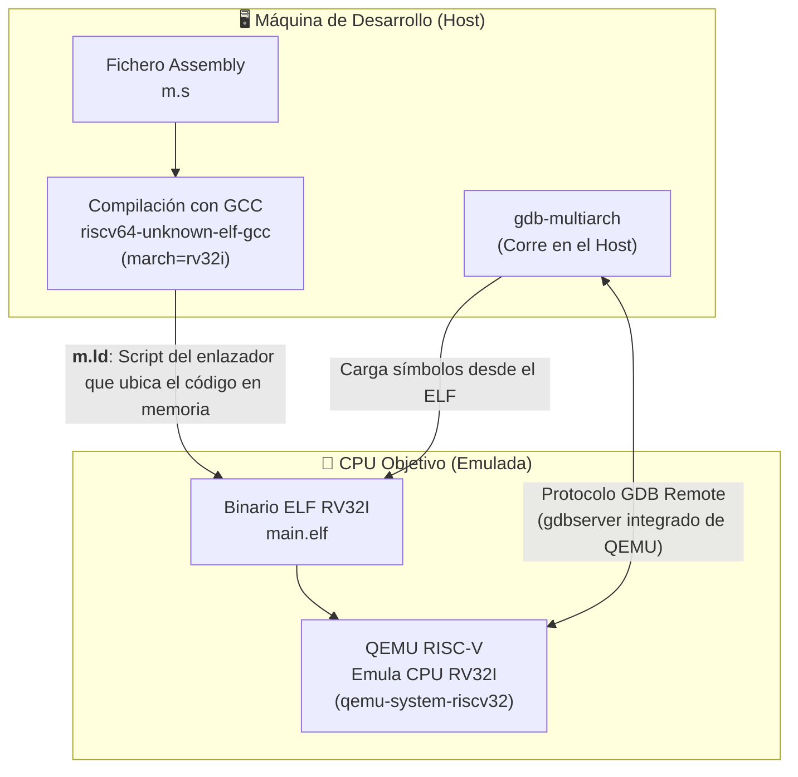

# TIL: Emulando una CPU RISC-V bare-metal con QEMU y GDB

Hoy he querido explorar el proceso de compilar, ejecutar y depurar un programa mínimo *bare-metal* para una CPU RISC-V. El objetivo es entender el flujo de herramientas completo, desde el código ensamblador hasta la depuración de registros en un procesador emulado, sin depender de ningún sistema operativo.

La arquitectura que vamos a montar es la siguiente:



## El Código: Un Programa Mínimo

Para mantenerlo simple, nuestro programa no hace nada más que entrar en un bucle infinito.

Primero, el código ensamblador en `m.s`:
```asm
_start:
  j _start
```
La etiqueta `_start` es el punto de entrada por defecto que el enlazador buscará en un entorno bare-metal. La instrucción `j _start` es un salto incondicional a esa misma etiqueta, creando un bucle infinito que simplemente consume ciclos de CPU.

Segundo, necesitamos un *linker script* (`m.ld`) para decirle al enlazador dónde debe colocar nuestro código en la memoria del sistema objetivo:
```ld
MEMORY
{
  RAM : ORIGIN  = 0x80000000, LENGTH = 4k
}

SECTIONS
{
  .text : {
    *(.text*)
  } > RAM
}
```
Este script define una región de memoria llamada `RAM` que comienza en la dirección `0x80000000` y tiene un tamaño de 4 KiB. Luego, instruye al enlazador para que cree una sección de salida `.text` (que contiene todo el código ejecutable) y la coloque al inicio de esa región `RAM`.

> He elegido `0x80000000` porque es la dirección donde la máquina virtual `virt` de QEMU para RISC-V mapea la memoria RAM por defecto. Si el binario estuviera enlazado para una dirección diferente, QEMU podría no ejecutarlo correctamente.

## El Flujo de Trabajo Paso a Paso

### 1. Compilar el Código para RISC-V

Usamos la toolchain de `riscv64-unknown-elf-gcc` para compilar nuestro código para un objetivo RV32I (RISC-V 32-bit con la extensión base de enteros).

```bash
riscv64-unknown-elf-gcc -O0 -ggdb -nostdlib -march=rv32i -mabi=ilp32 \
  -Wl,-Tm.ld m.s -o main.elf
```

Desgloce de los flags:
- `-O0`: Desactiva las optimizaciones. Crucial para que el código máquina se parezca lo más posible a nuestro código fuente, facilitando la depuración.
- `-ggdb`: Genera información de depuración completa para GDB (símbolos, números de línea, etc.).
- `-nostdlib`: No enlaza la librería estándar de C ni los ficheros de arranque (`crt0`). Nosotros proveemos nuestro propio punto de entrada `_start`.
- `-march=rv32i`: Especifica la arquitectura de destino: RISC-V 32-bit, conjunto de instrucciones base de enteros.
- `-mabi=ilp32`: Define la ABI (Application Binary Interface) donde los `int`, `long` y punteros ocupan 32 bits.
- `-Wl,-Tm.ld`: Pasa la opción `-T m.ld` directamente al enlazador (`ld`), indicándole que use nuestro script `m.ld` para organizar la memoria.
- `-o main.elf`: El fichero de salida en formato ELF, que contiene no solo el código, sino también metadatos, secciones y símbolos de depuración.

### 2. (Opcional) Inspeccionar el Binario

Para ver exactamente los bytes que la CPU ejecutará, podemos convertir el ELF a un binario plano y examinarlo con `xxd`.

```bash
riscv64-unknown-elf-objcopy -O binary main.elf main.bin
xxd -e -c 4 -g 4 main.bin
```
- `objcopy -O binary`: Extrae únicamente las secciones de código y datos, descartando todos los metadatos ELF.
- `xxd -e -c 4 -g 4`: Muestra el binario en formato hexadecimal, agrupado en palabras de 4 bytes (32 bits) y en formato little-endian, que es como RISC-V las procesa.

El resultado debería ser `6f000000`, que es la codificación de la instrucción `j 0x0` (salto a la misma dirección) en RV32I.

### 3. Iniciar la Simulación con QEMU

Ahora, lanzamos QEMU para emular un sistema RISC-V completo. Lo dejaremos en pausa, esperando a que el depurador se conecte.

```bash
qemu-system-riscv32 -S -M virt -nographic -bios none -kernel main.elf -gdb tcp::1234
```
- `-S`: Congela la CPU al inicio. No ejecuta ninguna instrucción hasta que se lo indiquemos (normalmente desde GDB).
- `-M virt`: Usa la máquina `virt`, una placa base virtual genérica para RISC-V que incluye RAM en `0x80000000` y otros dispositivos básicos.
- `-nographic`: Redirige la consola serie a la terminal. No necesitamos una GUI para este ejemplo.
- `-bios none`: No carga ninguna BIOS o firmware. QEMU ejecutará directamente nuestro `kernel`.
- `-kernel main.elf`: Carga nuestro fichero ELF en la memoria de la máquina emulada.
- `-gdb tcp::1234`: Activa el servidor GDB integrado de QEMU y lo pone a escuchar en el puerto TCP 1234.

En este punto, QEMU está emulando el hardware y, al mismo tiempo, actuando como un `gdbserver`.

### 4. Depurar la CPU Emulada con GDB

Finalmente, abrimos otra terminal y conectamos `gdb-multiarch` a QEMU.

```bash
gdb-multiarch main.elf \
  -ex "target remote localhost:1234" \
  -ex "break _start" \
  -ex "continue" -q
```
- `gdb-multiarch main.elf`: Iniciamos GDB y le pedimos que cargue los símbolos y la información de depuración de nuestro fichero `main.elf`. Así, GDB sabe qué es `_start` y a qué dirección de memoria corresponde.
- `-ex "target remote localhost:1234"`: Conecta GDB al `gdbserver` que QEMU está ejecutando. A partir de aquí, GDB controla la CPU remota (emulada).
- `-ex "break _start"`: Pone un punto de ruptura en la dirección de la etiqueta `_start`. GDB lo resuelve localmente usando los símbolos del ELF y le pide a QEMU que detenga la ejecución cuando el contador de programa (`pc`) alcance esa dirección.
- `-ex "continue"`: Le dice a QEMU que comience la ejecución (que estaba pausada por el flag `-S`). La CPU emulada arrancará, llegará a `_start` y se detendrá inmediatamente debido al punto de ruptura.
- `-q`: Inicia GDB en modo silencioso.

¡Y listo! Ahora deberías tener una sesión de GDB detenida en la primera instrucción de tu programa, lista para inspeccionar registros (`info registers`), avanzar instrucción por instrucción (`ni` instrucción de assembly, `n` statement de c) o analizar la memoria (`x/i $pc`).
