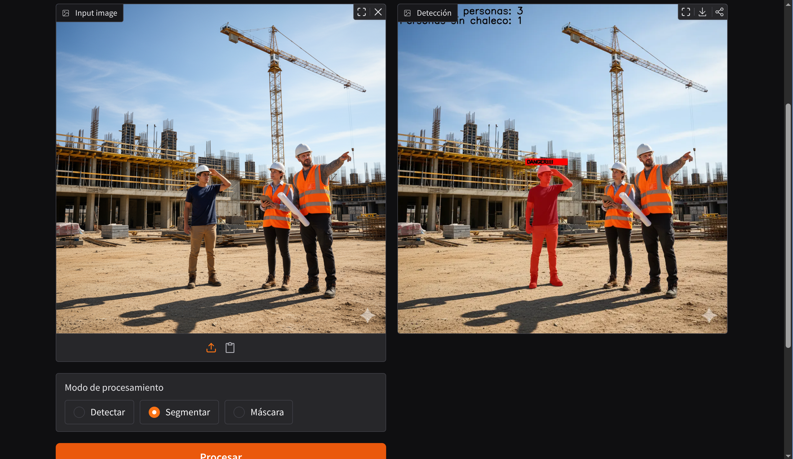
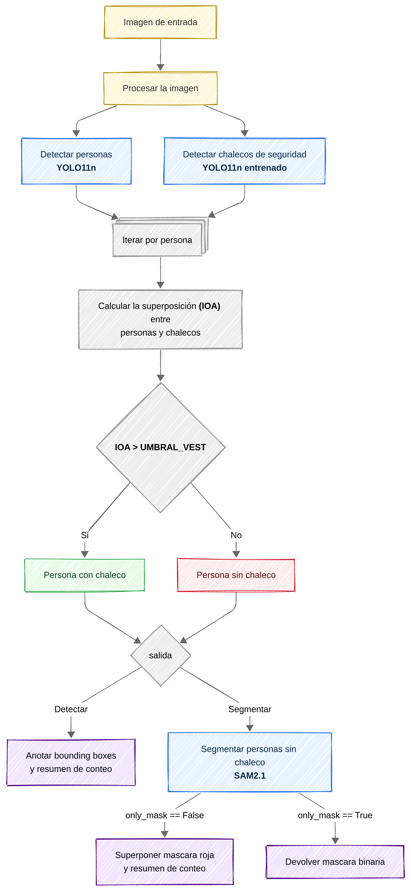
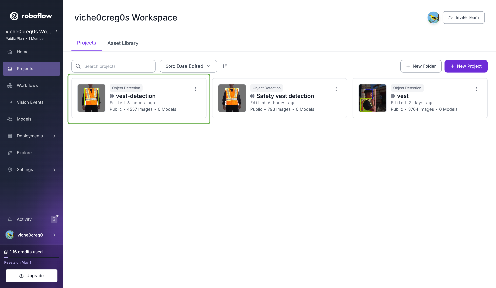
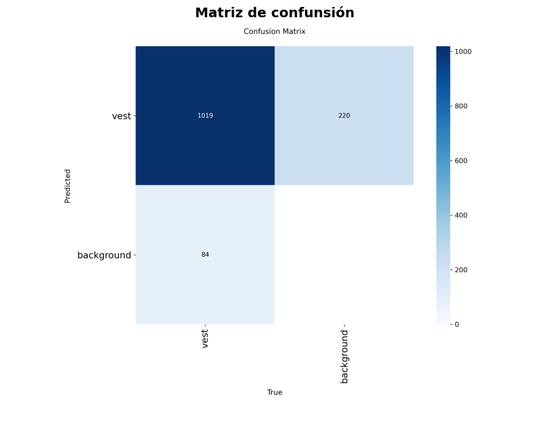
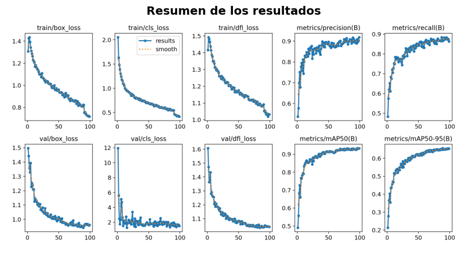
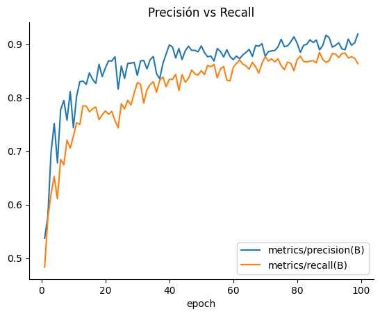
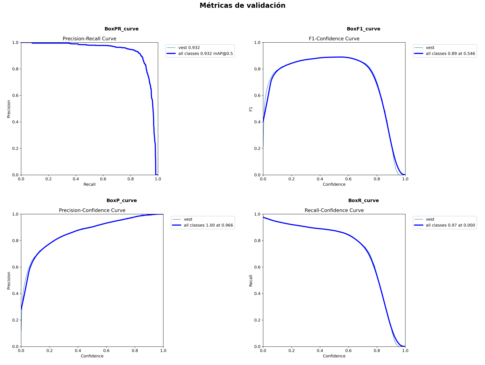
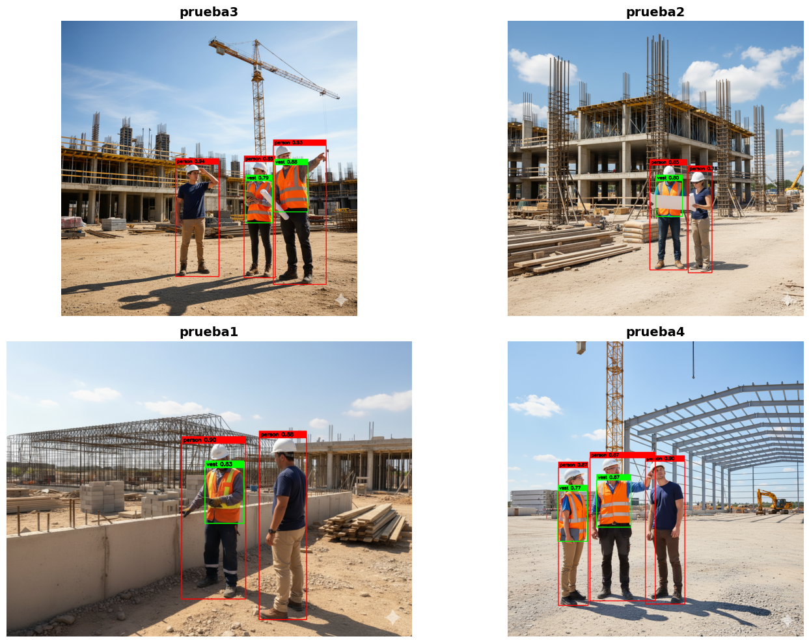
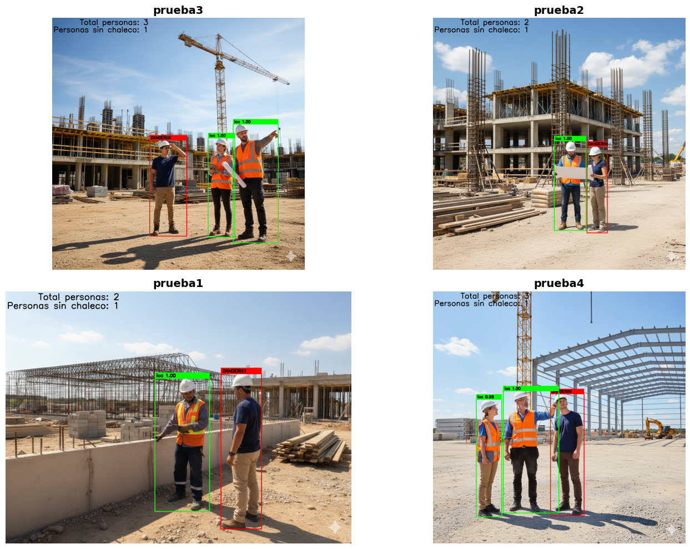
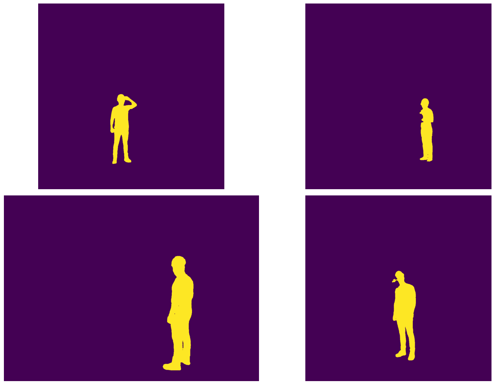

# Detectando personas sin chalecos de seguridad con YOLO y SAM

He estado experimentando con un proyecto práctico de visión por computador: un sistema que analiza una imagen e identifica a las personas que no están usando un chaleco de seguridad. Es un caso de uso clásico en entornos industriales o de construcción.

La aplicación final está desplegada en [Hugging Face Spaces](https://huggingface.co/spaces/vichel0creg0/vest-detection) y permite tres modos de visualización: las detecciones con bounding boxes, una imagen con las personas sin chaleco segmentadas, o únicamente la máscara de segmentación.



## La Arquitectura del Sistema



Mi enfoque fue bastante directo y se basa en combinar modelos especializados para cada tarea:

1.  **Detección de Personas:** Usé un modelo **YOLOv11** pre-entrenado. Es rápido, eficiente y muy bueno identificando objetos comunes como personas.
2.  **Detección de Chalecos:** Entrené un modelo **YOLOv11** específico para detectar únicamente chalecos de seguridad, utilizando un dataset que compilé desde Roboflow. El notebook de entrenamiento se puede consultar [aquí](https://huggingface.co/spaces/vichel0creg0/vest-detection/blob/main/notebooks/vest_detection.ipynb).
3.  **Segmentación de Personas:** Para el toque final, utilicé el potente **Segment Anything Model (SAM)** de **Ultralytics**. A partir de los bounding boxes de las personas sin chaleco, SAM es capaz de generar máscaras de segmentación muy precisas.

### Entrenando el detector de chalecos

El primer paso era conseguir un buen dataset. Encontré dos en [Roboflow Universe](https://roboflow.com) que parecían prometedores:
-   [vest Computer Vision Model](https://universe.roboflow.com/project-stixd/vest-5byyt): Este dataset incluye etiquetas para *cascos*, *personas*, *cinturones*, etc. Como solo me interesaban los chalecos, lo forkeé y eliminé las clases sobrantes para no introducir ruido en el entrenamiento.
-   [Safety vest detection Computer Vision Model](https://universe.roboflow.com/kevin-hall-mvpum/safety-vest-detection-9erd8)

Fusioné ambos datasets en uno solo para tener una mayor variedad de ejemplos: [vest-detection dataset on Roboflow](https://app.roboflow.com/viche0creg0s-workspace/vest-detection-z3jjb/1).



Para el entrenamiento con la librería de Ultralytics, partí de los pesos de `yolov11n.pt` y ajusté algunos hiperparámetros clave como el tamaño del batch, el número de épocas y el `patience` para el early stopping.

```python
class CFG:
    # configuraciones para el entrenamiento
    YAML_DIR = ROOT / 'vest-detection-1' / 'data.yaml'
    BATCH_SIZE = 8
    EPOCHS = 100
    PATIENCE = 10
    DEVICE = device

model = YOLO("yolo11n.pt")
model.train(data=CFG.YAML_DIR,
    batch=CFG.BATCH_SIZE,
    epochs=CFG.EPOCHS,
    patience=CFG.PATIENCE,
    device=CFG.DEVICE)
```

El rendimiento general del modelo fue bastante bueno, aunque la matriz de confusión mostró una ligera tendencia a los falsos positivos. Esto significa que a veces detecta chalecos donde no los hay, un problema que podría mitigarse con un dataset más limpio o con más ejemplos negativos.





La curva de Precisión-Recall es muy informativa. El mAP@0.5 (una métrica estándar para la detección de objetos) alcanzó un sólido **0.93**, lo que indica que el modelo es muy competente. La curva muestra que el modelo mantiene una alta precisión incluso a niveles de recall altos, lo cual es ideal.



El análisis final de las métricas de validación me ayudó a elegir un umbral de confianza óptimo en torno a **0.55**, que ofrecía el mejor equilibrio entre precisión y recall.



## El Núcleo Lógico: Asociar Chalecos con Personas

Una vez que tenía un modelo para detectar personas y otro para chalecos, el siguiente reto era determinar qué personas llevaban chaleco.



Para ello, necesitaba una función que midiera la superposición entre los bounding boxes de las personas y los de los chalecos. En lugar de usar un *Intersection over Union (IoU)* estándar, opté por calcular la **Intersection over Area (IoA)** del chaleco. Esto responde a una pregunta más útil para mi caso: **"¿Qué porcentaje del área del chaleco está dentro del área de la persona?"**. Es una métrica más robusta porque un chaleco pequeño dentro de una persona grande tendrá un IoA alto, mientras que su IoU podría ser bajo.

```python
def calcular_superposicion_chaleco(box_persona, box_chaleco):
    """
    Función auxiliar para calcular la superposición entre persona y chaleco.
    """
    # Cálculo de la intersección
    xA = max(box_persona[0], box_chaleco[0])
    yA = max(box_persona[1], box_chaleco[1])
    xB = min(box_persona[2], box_chaleco[2])
    yB = min(box_persona[3], box_chaleco[3])

    interArea = max(0, xB - xA) * max(0, yB - yA)
    # Calculo del área del chaleco
    area_chaleco = (box_chaleco[2] - box_chaleco[0]) * (box_chaleco[3] - box_chaleco[1])

    if area_chaleco == 0:
        return 0.0

    # Porcentaje del chaleco dentro de la persona
    porcentaje_superposicion = interArea / float(area_chaleco)
    return porcentaje_superposicion
```

Con esta función, el algoritmo es simple: para cada persona detectada, itero sobre todos los chalecos detectados. Si ninguno de los chalecos supera un umbral de superposición (lo establecí en un **30%**), marco a esa persona como "sin chaleco".




## Segmentación con SAM para una mejor visualización

Para el toque final, quería algo más que simples bounding boxes. Aquí es donde entra en juego el **Segment Anything Model (SAM)**. El proceso es muy sencillo:

1.  Identifico el bounding box de una persona sin chaleco.
2.  Paso la imagen completa y ese bounding box específico a SAM.
3.  SAM devuelve una máscara de segmentación precisa para el objeto dentro de ese box.

Repitiendo este proceso para cada persona sin chaleco, puedo generar una máscara combinada que resalta exactamente a los individuos en riesgo.




El código completo, incluyendo la lógica de la aplicación en Gradio, está disponible en este [**Hugging Face Space**](https://huggingface.co/spaces/vichel0creg0/vest-detection/tree/main).
