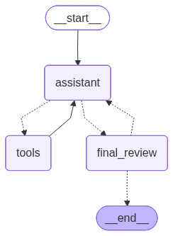
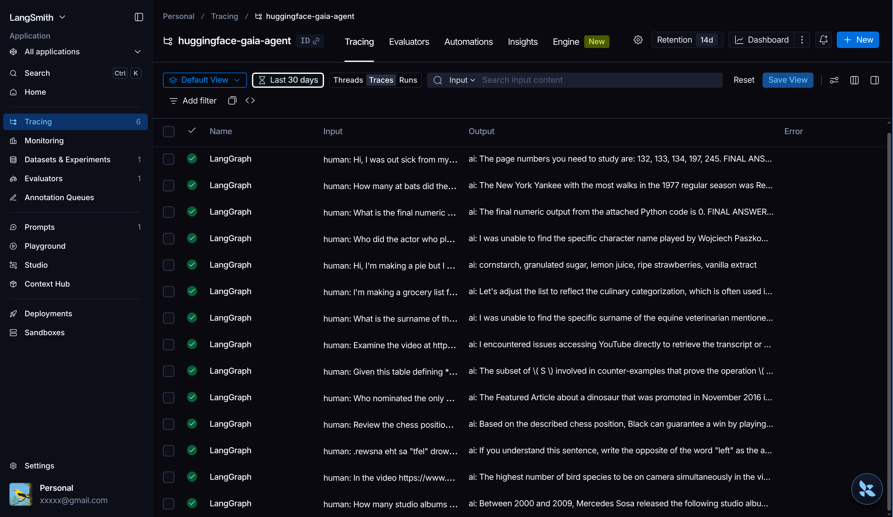
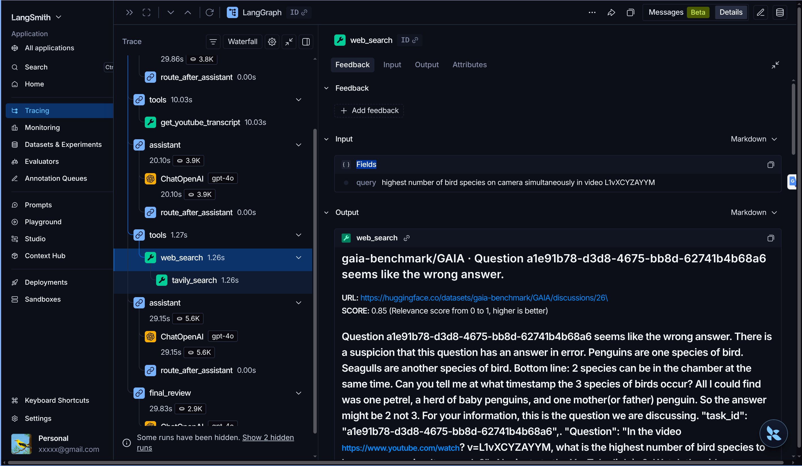
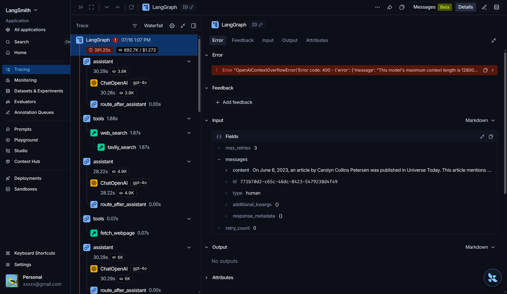

# Construyendo mi primer agente con el curso de Hugging Face

He estado explorando el mundo de los agentes de IA a través del [Curso de Agentes de Hugging Face](https://huggingface.co/learn/agents-course/unit0/introduction).

Lo primero es aclarar, ¿qué es exactamente un agente? No es nada esotérico:

> Un **Agente** es un sistema que utiliza un modelo de IA para razonar, planificar y ejecutar acciones interactuando con su entorno para lograr un objetivo definido por el usuario. En esencia, combina el "pensamiento" de un LLM con la capacidad de actuar a través de "herramientas" externas.

Este concepto es clave porque los LLM, por sí solos, están limitados al conocimiento congelado de sus datos de entrenamiento. No pueden realizar tareas tan sencillas como decirte qué día es hoy, ya que no tienen acceso a información en tiempo real.

Este simple fragmento de código lo demuestra:

```bash
~/agent ❯ ollama list
NAME                       ID              SIZE      MODIFIED
llama3.2:3b                a80c4f17acd5    2.0 GB    2 months ago
nomic-embed-text:latest    0a109f422b47    274 MB    2 months ago
llama3.2:1b                baf6a787fdff    1.3 GB    2 months ago
qwen2:7b                   dd314f039b9d    4.4 GB    4 months ago

~/agent ❯ python << EOF
from ollama import chat

messages = [{"role": "user", "content": "What the day today?"}]
response = chat(model="qwen2:7b", messages=messages)
print(response.message.content)
EOF
Today is February 7, 2023.
```

Los agentes solucionan este problema dotando al modelo de **herramientas** que puede utilizar para superar estas limitaciones. Al darle acceso a una simple función que consulta la fecha actual, el modelo puede responder correctamente.

```bash
~/agent ✗ python << EOF
from ollama import chat
import datetime as dt

def get_current_date() -> str:
  """Get the current date for today"""
  today = dt.date.today()
  return today.strftime("%Y-%m-%d")

messages = [{"role": "user", "content": "What day is it today?"}]
# Le pasamos la función como una herramienta disponible
response = chat(model="qwen2:7b", messages=messages, tools=[{"type": "function", "function": get_current_date}])
messages.append(response.message)

# El modelo responde pidiendo usar la herramienta
if response.message.tool_calls:
  # Para este ejemplo, asumimos una sola llamada a la herramienta
  call = response.message.tool_calls[0]
  result = get_current_date(**call.function.arguments)

  # Añadimos el resultado de la herramienta a la conversación
  messages.append({"role": "tool", "tool_call_id": call.id, "name": call.function.name, "content": str(result)})

  # Volvemos a llamar al modelo con el contexto actualizado
  final_response = chat(model="qwen2:7b", messages=messages)
  print(final_response.message.content)
EOF
Today is July 18, 2026.
```

La técnica que impulsa este comportamiento se conoce como **ReAct (Reasoning + Acting)**. Es un paradigma de prompting que guía al modelo para que verbalice su cadena de pensamiento, decida qué acción (herramienta) tomar, observe el resultado y repita este ciclo hasta resolver la tarea.

## El Desafío GAIA


El curso de Hugging Face presenta frameworks como `smol-agents`, `llamaindex` y `langgraph`, y culmina con un desafío: crear un agente capaz de superar una evaluación sobre un subconjunto de 20 preguntas de nivel 1 del [test GAIA](https://huggingface.co/papers/2311.12983). GAIA es un benchmark diseñado para medir la capacidad de razonamiento general de los asistentes de IA en tareas complejas.

Empecé utilizando el **system prompt** original del paper de GAIA como base:

> You are a general AI assistant. I will ask you a question. Report your thoughts, and finish your answer with the following template: FINAL ANSWER: [YOUR FINAL ANSWER]. YOUR FINAL ANSWER should be a number OR as few words as possible OR a comma separated list of numbers and/or strings...

Luego, lo fui refinando iterativamente (con la ayuda de otros LLMs) para integrar la definición de las herramientas y añadir algunas heurísticas para guiar mejor al agente.

## Mi Solución

Mi diseño final fue un asistente principal con acceso a un conjunto de herramientas bien definidas. Para intentar mejorar la fiabilidad, añadí un segundo agente que actuaba como **evaluador final**. Su única misión era revisar la respuesta del asistente principal y, o bien darle el visto bueno, o bien devolvérsela con sugerencias de mejora.



Integré todo el flujo con [LangSmith](https://www.langchain.com/langsmith) para tener una trazabilidad completa de cada paso, lo cual es indispensable para depurar y entender qué ocurre *under-the-hood*.



Para pasar la evaluación, la clave fue un buen **system prompt** y un conjunto básico de herramientas: búsqueda en Wikipedia, búsqueda web general y una calculadora.


## Aprendizajes Clave

Este proyecto me ha dejado varias lecciones prácticas muy valiosas:

1.  **El agente "evaluador" fue una hipótesis fallida.** En la práctica, intervenía en muy pocas ocasiones. Y cuando lo hacía, sus correcciones no ayudaban al agente principal a encontrar la respuesta correcta. Al final, se convirtió principalmente en un consumidor de tokens innecesario. Una lección sobre cómo la complejidad añadida no siempre se traduce en un mejor rendimiento.

2.  **La creatividad en el uso de herramientas es fundamental.** Un par de preguntas requerían información de vídeos de YouTube. Mi enfoque fue usar la [Youtube Transcript API](https://pypi.org/project/youtube-transcript-api/) para obtener las transcripciones. Sin embargo, no siempre están disponibles. Añadí una instrucción al *system prompt*: si la herramienta de transcripción falla, debe usar la búsqueda web para encontrar la URL del vídeo en otro lugar. ¡Funcionó! Para una de las preguntas, el agente encontró la URL del vídeo citada en un foro de Hugging Face.

    

3.  **Los agentes necesitan guardrails.** Mi agente evaluador tenía un límite de tres revisiones, pero el agente principal no tenía límite de iteraciones con sus herramientas. Esto es peligroso. En preguntas complejas, el agente podía entrar en bucles de investigación, perdiéndose en la búsqueda de información hasta agotar la ventana de contexto del modelo. Es crucial establecer un número máximo de pasos o iteraciones para evitar este comportamiento.

    

4.  **La caché es tu mejor amiga.** Una vez que empecé a probar el agente en el conjunto completo de preguntas, los costes y la latencia se dispararon. Implementar una capa de caché para las llamadas a las herramientas y al LLM es fundamental para iterar de forma eficiente y no gastar tokens innecesariamente en ejecuciones repetidas.

5.  **El éxito se reduce a dos cosas:**
    *   **Un *system prompt* claro y detallado:** Es el ADN de tu agente. Define su personalidad, sus objetivos, cómo debe usar las herramientas y cómo debe formatear la respuesta.
    *   **Herramientas simples y bien documentadas:** Cada herramienta debe hacer una sola cosa y hacerla bien. Las descripciones (docstrings) son cruciales, ya que es lo que el LLM "lee" para decidir qué herramienta usar.

El código completo de mi solución está disponible en [**Hugging Face Spaces**](https://huggingface.co/spaces/vichel0creg0/agents-course/tree/main).
